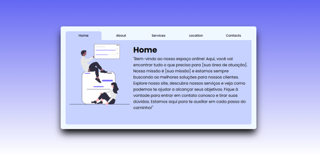

# Projeto de Abas Interativas

Este projeto demonstra a implementação de abas interativas em uma página web, conforme apresentado na imagem.

## Visão Geral

O projeto consiste em uma interface de usuário com as seguintes seções principais:

* **Home:** A página inicial com uma breve descrição.
* **About:** (A ser implementado) Uma seção para fornecer informações sobre a empresa ou projeto.
* **Services:** (A ser implementado) Uma seção para listar os serviços oferecidos.
* **Location:** (A ser implementado) Uma seção para exibir a localização.
* **Contacts:** (A ser implementado) Uma seção para fornecer informações de contato.

## Funcionalidades

* **Abas Interativas:** Os usuários podem clicar nas abas (Home, About, Services, Location, Contacts ) para navegar entre as diferentes seções da página.
* **Conteúdo da Página Inicial:** A páginas (Tabs) exibem textos de exemplo ("Que podem ser alterados...").
* **Conteúdo responsivo:** Pertindo que o projeto seja exibido em diferentes tamanhos de telas sem perder suas características.

## Tecnologias Utilizadas

* HTML5
* CSS3
* JavaScript (para a interatividade das abas)

## Como Executar o Projeto

1.  Clone o repositório para sua máquina local.
2.  Abra o arquivo `index.html` em seu navegador web.

## Implementação das Abas

A interatividade das abas é implementada usando JavaScript. Quando uma aba é clicada, o conteúdo correspondente é exibido e as outras abas são desativadas.

## Próximos Passos

* Implementar as seções "About", "Services", "Location" e "Contacts"  com conteúdo relevante.
* Adicionar estilos CSS para melhorar a aparência da página.
* Implementar funcionalidades adicionais, como animações e transições.

## Contribuição

Contribuições são bem-vindas! Sinta-se à vontade para enviar pull requests com melhorias e novas funcionalidades.

## Licença

Este projeto está licenciado sob a [Licença MIT](LICENSE).       
